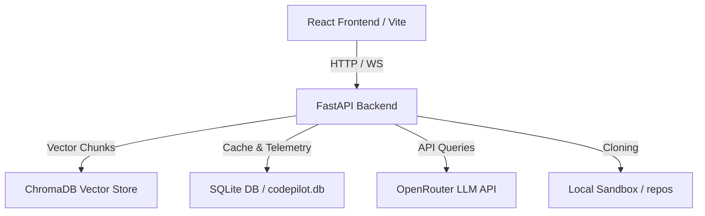
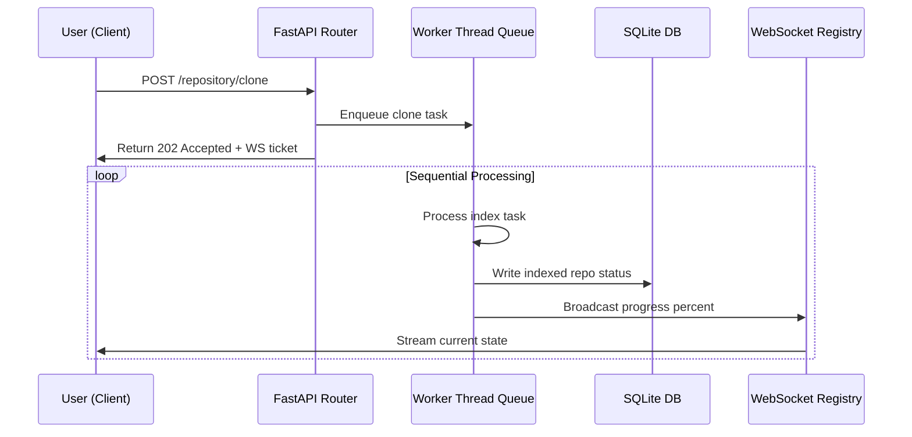
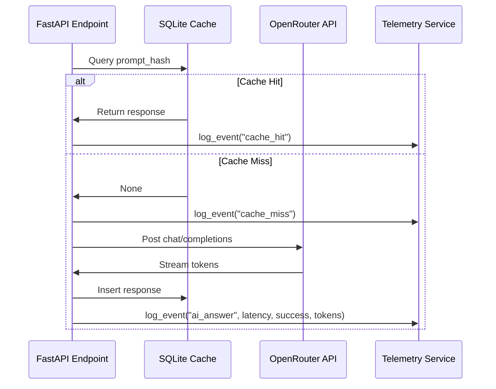

# CodePilot AI — Codebase Architecture & Technical Guide

This document provides a comprehensive overview of the design patterns, data schemas, sequence flows, and deployment configurations of CodePilot AI.

---

## 1. System Architecture

CodePilot AI is divided into a high-performance Python (FastAPI) backend and a responsive glassmorphic React (Vite) frontend.



### Frontend (`/frontend`)
- **Build Engine**: Vite + Rollup. Uses code splitting to isolate heavy modules (`@xyflow/react` and `@monaco-editor/react`) into separate vendor chunks.
- **Routing & Tabs**: Managed dynamically in [AIWorkspace.jsx](file:///d:/codepilot-ai/frontend/src/components/workspace/AIWorkspace.jsx) using React `lazy` and `Suspense` fallbacks with shimmering `SkeletonLoader` placeholders.
- **Reliability Interceptor**: Installs an Axios response interceptor that transparently retries failed request attempts using exponential backoff (e.g., $2^{retry} \times 1000$ ms) for transient $5xx$ status codes or connection drops.
- **Interactive Tour & Onboarding**: Guides new users through core workflows utilizing a welcome checklist and step-by-step tooltip UI saved via `localStorage`.

### Backend (`/backend`)
- **API Engine**: FastAPI running Uvicorn. Exposes REST endpoints and WebSockets for streaming telemetry and cloning tasks.
- **Task Worker Queue**: Thread-safe daemon background queue (`queue.Queue`) that processes indexing and cloning tasks sequentially to avoid database lock contention.
- **Path Validation**: Safe path resolution helper prevents directory traversal attacks by validating that all filesystem read/write parameters remain strictly bounded inside the cloned `repos/` directories or workspace.

---

## 2. Database Schemas (`codepilot.db`)

SQLite is used for caching, telemetry logging, and repository metadata.

### `embedding_cache`
Stores precomputed text embedding vectors to avoid duplicate SentenceTransformer operations.
- `text_hash` (TEXT PRIMARY KEY) — SHA-256 hash of code snippet text.
- `embedding` (TEXT) — JSON-serialized float array representing the vector.

### `llm_cache`
Stores LLM prompt completions to avoid duplicate API requests.
- `prompt_hash` (TEXT PRIMARY KEY) — SHA-256 hash of the formatted prompt.
- `response` (TEXT) — Cached textual completion.
- `created_at` (TIMESTAMP) — Time of cache entry creation.

### `analytics_cache`
Stores cyclomatic complexity and indexing metrics of repositories.
- `repo_path` (TEXT PRIMARY KEY) — Absolute path of the workspace repository.
- `analytics_data` (TEXT) — JSON string containing metrics.
- `created_at` (TIMESTAMP) — Invalidation tracker timestamp.

### `telemetry_logs`
Tracks API response latencies, execution successes, and token counts.
- `id` (INTEGER PRIMARY KEY AUTOINCREMENT)
- `event_type` (TEXT) — E.g. `'ai_answer'`, `'cache_hit'`, `'cache_miss'`.
- `latency` (REAL) — Duration in seconds.
- `success` (INTEGER) — $1$ for success, $0$ for failure.
- `error_message` (TEXT) — Traceback snippet if failed.
- `token_count` (INTEGER) — Total prompt/completion tokens.
- `timestamp` (TIMESTAMP)

---

## 3. Sequence Flows

### Background Indexing Task Queue


### Telemetry Recording Flow


---

## 4. Deployment Instructions

### Prerequisites
- Python 3.11+
- Node.js 20+

### Backend Setup
1. Navigate to `/backend` directory.
2. Initialize virtual environment:
   ```bash
   python -m venv venv
   .\venv\Scripts\activate
   ```
3. Install dependencies:
   ```bash
   pip install -r requirements.txt
   ```
4. Copy `.env.example` to `.env` and configure your API keys.
5. Start development server:
   ```bash
   uvicorn main:app --reload --port 8000
   ```

### Frontend Setup
1. Navigate to `/frontend` directory.
2. Install packages:
   ```bash
   npm install
   ```
3. Start the Vite dev server:
   ```bash
   npm run dev
   ```
